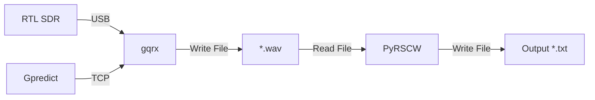

<h1 align="center"> PyRSCW </h1> 

PyRSCW is a python tool for decoding machine generated CW (morse code) transmissions from audio files. This tool was inspired and developed using the algorithms from the morse decoding software "RSCW" by PA3FWM ([RSCW](http://wwwhome.cs.utwente.nl/~ptdeboer/ham/rscw/)).

This library was originally written to decode the output *.wav files from GQRX for decoding telemetry from the [XW2](https://amsat-uk.org/satellites/communications/camsat-xw-2/) series of satellites launched by CAMSAT (the Chinese Amateur Satellite Group).

This software was developed for Python3.x and has only been tested on Python 3.6.7. It may work with other versions although this has not been tested (yet!).

## Dependencies
PyRSCW requires the following Python packages:
 - NumPy (tested with ver. 1.15.4)
 - SciPy (tested with ver. 1.2.0)
 - MatplotLib (tested with ver. 3.0.2)
 - wavio (tested with ver. 0.0.4)

These can all be installed using pip3 with the following command:
```
pip3 install numpy scipy matplotlib wavio
```

## Installation
To run this software, clone this [repo](https://github.com/m0zjo-code/Pyrscw) and install the dependencies above. That's it!

## Usage

TBC

If you have any issues or questions please raise an issue on this repo - I'll be happy to help!

## Example Data for Testing
TBC

<h1 align="center"> Satellite Tracking Setup </h1> 



## Equipment
To track satellites I use a RTL-SDR V3. For antennas I use a portable V dipole antenna kit and also a broadband LNA. All of these can be purchased from the page below:
 - https://www.rtl-sdr.com/buy-rtl-sdr-dvb-t-dongles/   
 
I would recommend buying through this website as there are lots of fakes on places like eBay.


## Software

I use the following software packages:
 - Gpredict (for satellite parameter calculation) - http://gpredict.oz9aec.net
 - gqrx (for interfacing with the RTL-SDR/other SDR) - http://gqrx.dk
 - PyRSCW (for decoding the CW telemetry of course!)

For more info on how to set these packages up please look here (TODO).

